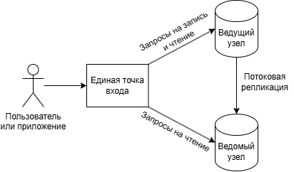
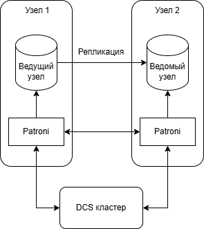
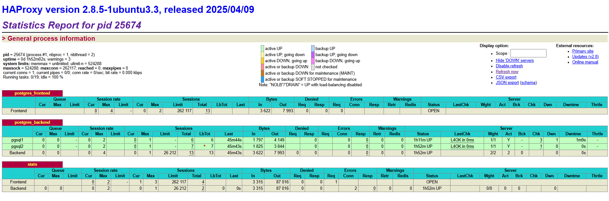

# Создание и тестирование высоконагруженного отказоустойчивого кластера PostgreSQL на базе Patroni

## Цель:

- Создать кластер PostgreSQL на базе Patroni
- Протестировать автоматическое переключение на резервный сервер

## Задачи

- Создать кластер виртуальных машин
- Создать кластер PostgreSQL
- Добиться отказоустойчивости кластера PostgreSQL
- Добиться высокой доступности кластера PostgreSQL

## Решение

### Общая архитектура

- Общая архитектура решения представляет собой организацию единой точки входа для запросов к базам данных от приложений или пользователей.
- Двухузловой кластер PostgreSQL, в котором один ведущий узел и один синхронный ведомый узел.
- Доступность и согласованность данных на узлах достигается механизмом потоковой репликации.
- Такой кластер позволит пережить недоступность одного из узлов.
- Достоинством такого кластера является его экономичность.



### Надежность

- Надежность кластера достигается путем дублирования компонентов на различные виртуальные машины.
- Поэтому в кластере присутствует узел, который является точной копией ведущего узла.

### Отказоустойчивость

- Отказоустойчивость достигается автоматическим переключением на резервный узел в случае отказа основного узла.
- Если ведущий узел становится недоступен, то ведомый узел берет роль ведущего на себя, что обеспечивает непрерывность работы приложений и позволяет избежать простоев.
- PostgreSQL не позволяет добиться автоматического переключения из коробки.
- Для обеспечения этого будем использовать приложение Patroni.
- Patroni устанавливается и запускается на каждом узле, где есть PostgreSQL, управляет кластером PostgreSQL и принимает решение кто в настоящий момент ведущий узел.

### Конфигурируемость

- Для обеспечения конфигурируемости добавим распределенную систему конфигураций (DCS).
- В качестве DCS будем использовать Etcd, который развернем на одном узле.
- Для целей тестирования одного узла Etcd будет достаточно.
- В целевой схеме будем использовать DSC кластер из трех узлов.

### Высокая доступность

- Высокая доступность обеспечивается распределением запросов на чтение между всеми узлами кластера.
- Для обеспечения высокой доступности и балансировки нагрузки будем использовать HAProxy.

### Архитектура кластера



### Технологии

1. Yandex Cloud
2. PostgreSQL
3. Patroni
4. Etcd
5. HAProxy

### Параметры виртуальных машин

- Платформа Intel Ice Lake
- Гарантированная доля vCPU 100%
- vCPU 2
- RAM 2 ГБ
- SSD 10 ГБ

## Пошаговая инструкция и результаты

### Создаем сетевую инфраструктуру

`yc vpc network create --name otus-net --description "otus-net"`

`yc vpc network list`
```
+----------------------+----------+
|          ID          |   NAME   |
+----------------------+----------+
| enpgjg25p0an05n5v0so | default  |
| enpm3lgi7mg26g0g7len | otus-net |
+----------------------+----------+
```

`yc vpc subnet create --name otus-subnet --range 10.0.0.0/24 --network-name otus-net --description "otus-subnet"`

`yc vpc subnet list`
```
+----------------------+-----------------------+----------------------+----------------+---------------+-----------------+
|          ID          |         NAME          |      NETWORK ID      | ROUTE TABLE ID |     ZONE      |      RANGE      |
+----------------------+-----------------------+----------------------+----------------+---------------+-----------------+
| e2lm6t2tkul1n8kaojni | default-ru-central1-b | enpgjg25p0an05n5v0so |                | ru-central1-b | [10.129.0.0/24] |
| e9b96i19b7gl5m3d7gbp | default-ru-central1-a | enpgjg25p0an05n5v0so |                | ru-central1-a | [10.128.0.0/24] |
| fl82i90qq97mprpudcr7 | default-ru-central1-d | enpgjg25p0an05n5v0so |                | ru-central1-d | [10.130.0.0/24] |
| fl8scf3f4oce1sl1tksr | otus-subnet           | enpm3lgi7mg26g0g7len |                | ru-central1-d | [10.0.0.0/24]   |
+----------------------+-----------------------+----------------------+----------------+---------------+-----------------+
```

`yc dns zone create --name otus-dns --zone staging. --private-visibility network-ids=enpm3lgi7mg26g0g7len`

`yc dns zone list`
```
+----------------------+--------------------------------------------+------------------+------------------------------+--------------------------------+
|          ID          |                    NAME                    |       ZONE       |          VISIBILITY          |          DESCRIPTION           |
+----------------------+--------------------------------------------+------------------+------------------------------+--------------------------------+
| dns71b4h7frd18ov2cmt | auto-enpgjg25p0an05n5v0so-internal_        | internal.        | PRIVATE enpgjg25p0an05n5v0so | Automatically created DNS      |
|                      |                                            |                  |                              | zone "internal." for network   |
|                      |                                            |                  |                              | (enpgjg25p0an05n5v0so)         |
| dns7eg9eggc11bqc5733 | auto-enpgjg25p0an05n5v0so-10_in-addr_arpa_ | 10.in-addr.arpa. | PRIVATE enpgjg25p0an05n5v0so | Automatically created DNS zone |
|                      |                                            |                  |                              | "10.in-addr.arpa." for network |
|                      |                                            |                  |                              | (enpgjg25p0an05n5v0so)         |
| dnscj369mi8an9i2ck5k | otus-dns                                   | staging.         |                              |                                |
+----------------------+--------------------------------------------+------------------+------------------------------+--------------------------------+
```

### Развернем виртуальную машину для Etcd

`yc compute instance create --name etcd --hostname etcd --cores 2 --memory 2 --create-boot-disk size=10G,type=network-hdd,image-folder-id=standard-images,image-family=ubuntu-2404-lts --network-interface subnet-name=otus-subnet,nat-ip-version=ipv4 --ssh-key dwertyapp_yc_key.pub`

`yc compute instances list`
```
+----------------------+--------+---------------+---------+-----------------+-------------+
|          ID          |  NAME  |    ZONE ID    | STATUS  |   EXTERNAL IP   | INTERNAL IP |
+----------------------+--------+---------------+---------+-----------------+-------------+
| fv405t9d867idb2nva98 | etcd   | ru-central1-d | RUNNING | 51.250.35.207   | 10.0.0.13   |
+----------------------+--------+---------------+---------+-----------------+-------------+
```

### Устанавливаем Etcd на виртуальную машину

Установим сервис

`sudo apt update && sudo apt upgrade && sudo apt install -y etcd-server`

Проверим, что установлен

`sudo etcd --version`
```
etcd Version: 3.4.30
Git SHA: Not provided (use ./build instead of go build)
Go Version: go1.22.2
Go OS/Arch: linux/amd64
```

Остановим сервис

`sudo systemctl stop etcd`

Убедимся, что он авто-запускаем

`sudo systemctl is-enabled etcd`
```
enabled
```

Убедимся, что не запущен

`sudo systemctl status etcd`
```
Stopped etcd.service - etcd - highly-available key value store.
```

Добавим конфигурацию

`/etc/default/etcd`

[etcd](etcd)

Запустим сервис

`sudo systemctl start etcd`

Проверим статус

`sudo systemctl status etcd`
```
Started etcd.service - etcd - highly-available key value store.
```

Убедимся, что кластер запущен

`etcdctl --write-out=table --endpoints=10.0.0.13:2380 endpoint status`
```
+----------------+------------------+---------+---------+-----------+------------+-----------+------------+--------------------+--------+
|    ENDPOINT    |        ID        | VERSION | DB SIZE | IS LEADER | IS LEARNER | RAFT TERM | RAFT INDEX | RAFT APPLIED INDEX | ERRORS |
+----------------+------------------+---------+---------+-----------+------------+-----------+------------+--------------------+--------+
| 10.0.0.13:2380 | a10d8f7920cc71c7 |  3.4.30 |   20 kB |      true |      false |         2 |          4 |                  4 |        |
+----------------+------------------+---------+---------+-----------+------------+-----------+------------+--------------------+--------+
```

### Развернем две виртуальные машины для PostgreSQL

`yc compute instance create --name pgsql1 --hostname pgsql1 --cores 2 --memory 2 --create-boot-disk size=10G,type=network-hdd,image-folder-id=standard-images,image-family=ubuntu-2404-lts --network-interface subnet-name=otus-subnet,nat-ip-version=ipv4 --ssh-key dwertyapp_yc_key.pub`

`yc compute instance create --name pgsql2 --hostname pgsql2 --cores 2 --memory 2 --create-boot-disk size=10G,type=network-hdd,image-folder-id=standard-images,image-family=ubuntu-2404-lts --network-interface subnet-name=otus-subnet,nat-ip-version=ipv4 --ssh-key dwertyapp_yc_key.pub`

`yc compute instances list`
```
+----------------------+--------+---------------+---------+-----------------+-------------+
|          ID          |  NAME  |    ZONE ID    | STATUS  |   EXTERNAL IP   | INTERNAL IP |
+----------------------+--------+---------------+---------+-----------------+-------------+
| fv405t9d867idb2nva98 | etcd   | ru-central1-d | RUNNING | 51.250.35.207   | 10.0.0.13   |
| fv4pudqpsutb3cmiivkq | pgsql1 | ru-central1-d | RUNNING | 84.252.133.37   | 10.0.0.33   |
| fv4s0vdn5frhi9nn3t60 | pgsql2 | ru-central1-d | RUNNING | 158.160.131.155 | 10.0.0.11   |
+----------------------+--------+---------------+---------+-----------------+-------------+
```

### Устанавливаем PostgreSQL на двух виртуальных машинах

`sudo apt update && sudo apt upgrade -y -q && sudo sh -c 'echo "deb http://apt.postgresql.org/pub/repos/apt $(lsb_release -cs)-pgdg main" > /etc/apt/sources.list.d/pgdg.list' && wget --quiet -O - https://www.postgresql.org/media/keys/ACCC4CF8.asc | sudo apt-key add - && sudo apt-get update && sudo apt -y install postgresql-17`

`sudo -u postgres pg_lsclusters`
```
Ver Cluster Port Status Owner    Data directory              Log file
17  main    5432 online postgres /var/lib/postgresql/17/main /var/log/postgresql/postgresql-17-main.log
```

### Устанавливаем Patroni на двух виртуальных машинах

`sudo apt install -y python3 python3-pip git mc && sudo apt install python3-psycopg2 && sudo systemctl stop postgresql@17-main && sudo -u postgres pg_dropcluster 17 main && sudo pip3 install patroni[etcd] --break-system-packages && sudo ln -s /usr/local/bin/patroni /bin/patroni`

`/usr/local/bin/patroni --version`
```
patroni 4.0.5
```

Добавим файл сервиса /etc/systemd/system/patroni.service

[patroni.service](patroni.service)

Создадим папку для хранения файлов и назначим ей нужные права, в нашем случае это /mnt/patroni.

`sudo systemctl daemon-reload && sudo apt install etcd-client && sudo mkdir /mnt/patroni && sudo chown postgres:postgres /mnt/patroni && sudo chmod 700 /mnt/patroni`

Добавим файл конфигурации /etc/patroni.yml

[pgsql1 patroni.yml](pgsql1-patroni.yml)

[pgsql2 patroni.yml](pgsql2-patroni.yml)

Проверим файлы конфигураций

`patroni --validate-config patroni.yml`

Запустим сервис

`sudo systemctl enable patroni && sudo systemctl start patroni`

Убедимся, что кластер запущен

`sudo patronictl -c /etc/patroni.yml list`
```
+ Cluster: patroni (7489853953138796848) ----------+----+-----------+
| Member    | Host      | Role         | State     | TL | Lag in MB |
+-----------+-----------+--------------+-----------+----+-----------+
| 10.0.0.11 | 10.0.0.11 | Sync Standby | streaming | 11 |         0 |
| 10.0.0.33 | 10.0.0.33 | Leader       | running   | 11 |           |
+-----------+-----------+--------------+-----------+----+-----------+
```

### Развернем виртуальную машину для HAProxy

`yc compute instance create --name haproxy --hostname haproxy --cores 2 --memory 2 --create-boot-disk size=10G,type=network-hdd,image-folder-id=standard-images,image-family=ubuntu-2404-lts --network-interface subnet-name=otus-subnet,nat-ip-version=ipv4 --ssh-key dwertyapp_yc_key.pub`

`yc compute instances list`
```
+----------------------+---------+---------------+---------+-----------------+-------------+
|          ID          |  NAME   |    ZONE ID    | STATUS  |   EXTERNAL IP   | INTERNAL IP |
+----------------------+---------+---------------+---------+-----------------+-------------+
| fv405t9d867idb2nva98 | etcd    | ru-central1-d | RUNNING | 51.250.35.207   | 10.0.0.13   |
| fv452itgp9c788pr6m7o | haproxy | ru-central1-d | RUNNING | 158.160.140.235 | 10.0.0.19   |
| fv4pudqpsutb3cmiivkq | pgsql1  | ru-central1-d | RUNNING | 84.252.133.37   | 10.0.0.33   |
| fv4s0vdn5frhi9nn3t60 | pgsql2  | ru-central1-d | RUNNING | 158.160.131.155 | 10.0.0.11   |
+----------------------+---------+---------------+---------+-----------------+-------------+
```

### Устанавливаем HAProxy на виртуальной машине

`sudo apt update && sudo apt upgrade && sudo apt install -y haproxy`

Правим конфиг

`/etc/haproxy/haproxy.cfg`

[haproxy](haproxy)

Перезапускаем сервис

`sudo systemctl restart haproxy`

Проверяем статус

`sudo systemctl status haproxy`
```
Started haproxy.service - HAProxy Load Balancer.
```

Проверим статистику HAProxy



## Проверяем автоматическое переключение на резервный узел

Проверяем перед проверкой

`sudo patronictl -c /etc/patroni.yml list`
```
+ Cluster: patroni (7489853953138796848) ----------+----+-----------+
| Member    | Host      | Role         | State     | TL | Lag in MB |
+-----------+-----------+--------------+-----------+----+-----------+
| 10.0.0.11 | 10.0.0.11 | Sync Standby | streaming | 11 |         0 |
| 10.0.0.33 | 10.0.0.33 | Leader       | running   | 11 |           |
+-----------+-----------+--------------+-----------+----+-----------+
```

Выключаем узел pgsql1(10.0.0.33)

`sudo systemctl stop patroni`

Убеждаем, что роль ведущего узла переключилась

`sudo patronictl -c /etc/patroni.yml list`
```
+ Cluster: patroni (7489853953138796848) --+----+-----------+
| Member    | Host      | Role   | State   | TL | Lag in MB |
+-----------+-----------+--------+---------+----+-----------+
| 10.0.0.11 | 10.0.0.11 | Leader | running | 12 |           |
+-----------+-----------+--------+---------+----+-----------+
```

Включаем узел pgsql1(10.0.0.33)

`sudo systemctl start patroni`

Убеждаем, что узел pgsql1(10.0.0.33) снова в кластере

`sudo patronictl -c /etc/patroni.yml list`
```
+ Cluster: patroni (7489853953138796848) ----------+----+-----------+
| Member    | Host      | Role         | State     | TL | Lag in MB |
+-----------+-----------+--------------+-----------+----+-----------+
| 10.0.0.11 | 10.0.0.11 | Leader       | running   | 12 |           |
| 10.0.0.33 | 10.0.0.33 | Sync Standby | streaming | 12 |         0 |
+-----------+-----------+--------------+-----------+----+-----------+
```

## Проверяем ручное переключение на резервный узел

Проверяем перед проверкой

`sudo patronictl -c /etc/patroni.yml list`
```
+ Cluster: patroni (7489853953138796848) ----------+----+-----------+
| Member    | Host      | Role         | State     | TL | Lag in MB |
+-----------+-----------+--------------+-----------+----+-----------+
| 10.0.0.11 | 10.0.0.11 | Leader       | running   | 12 |           |
| 10.0.0.33 | 10.0.0.33 | Sync Standby | streaming | 12 |         0 |
+-----------+-----------+--------------+-----------+----+-----------+
```

Переключаем вручную роль ведущего узла с pgsql2(10.0.0.11) на pgsql1(10.0.0.33)

`sudo patronictl -c /etc/patroni.yml switchover patroni`

Убеждаем, что узел pgsql1(10.0.0.33) имеет роль ведущего узла

`sudo patronictl -c /etc/patroni.yml list`
```
+ Cluster: patroni (7489853953138796848) ----------+----+-----------+
| Member    | Host      | Role         | State     | TL | Lag in MB |
+-----------+-----------+--------------+-----------+----+-----------+
| 10.0.0.11 | 10.0.0.11 | Sync Standby | streaming | 13 |         0 |
| 10.0.0.33 | 10.0.0.33 | Leader       | running   | 13 |           |
+-----------+-----------+--------------+-----------+----+-----------+
```

## Итоги

- Успешно создан кластер виртуальных машин в YC
- Успешно создан кластер PostgreSQL на базе Patroni
- Удалось добиться отказоустойчивости кластера PostgreSQL за счет автоматического переключения на резервный узел
- Удалось добиться высокой доступности кластера PostgreSQL за счет разделения нагрузки
